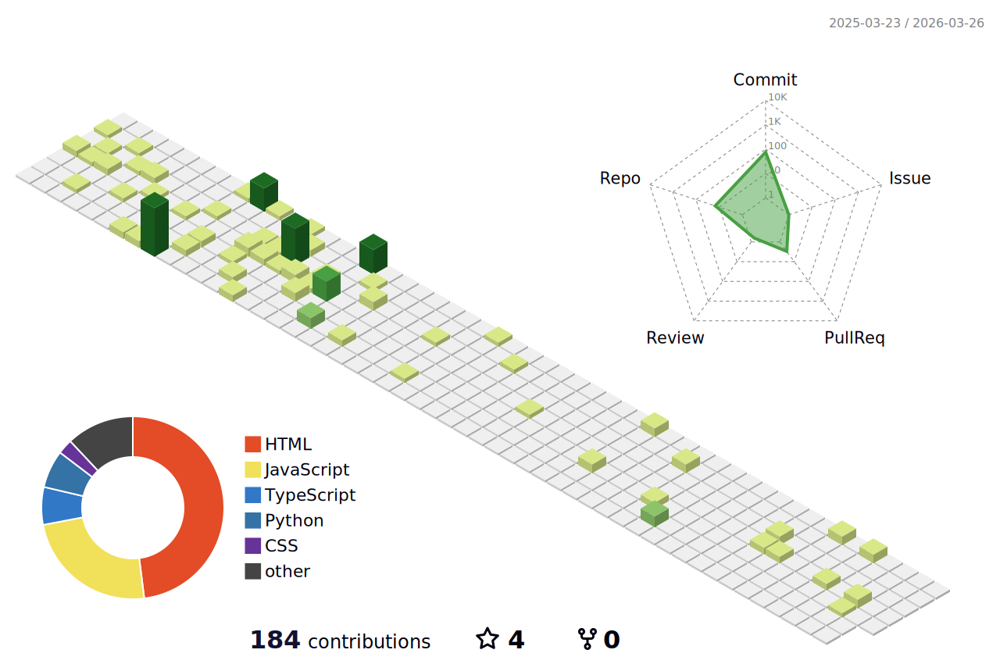

<!-- 🌊 Animated Wave Header -->

  
  
  

---

## 🚀 About Me
🌐 **Full-Stack Developer** | MERN | ASP.NET | Python | C++  
📚 Built **E-Learning Platform** & **Water Supply Management System**  
📬 Reach me at: **makvanapankaj608@gmail.com**

---

## 🛠️ My Tech Stack

  

---

## 🖤 Featured Projects

### 📚 E-Learning Platform (MERN Stack)
Interactive platform for students and instructors.  
**✨ Features:**
- 🔐 User authentication
- 🧑‍🏫 Course management
- 📺 Video streaming

---

### 💧 Water Supply Management System (ASP.NET)

**✨ Features:**
- ⚙️ Admin control panel
- 📅 Water distribution scheduler

---

## 📊 GitHub Stats

  
  

---

## 🌈 Most Used Languages

  

---

## 🧊 3D Contributions Calendar

  

---

## 🐍 Contribution Snake Animation

  

---

## 🕵️‍♂️ Profile Visitors

  

---

  

