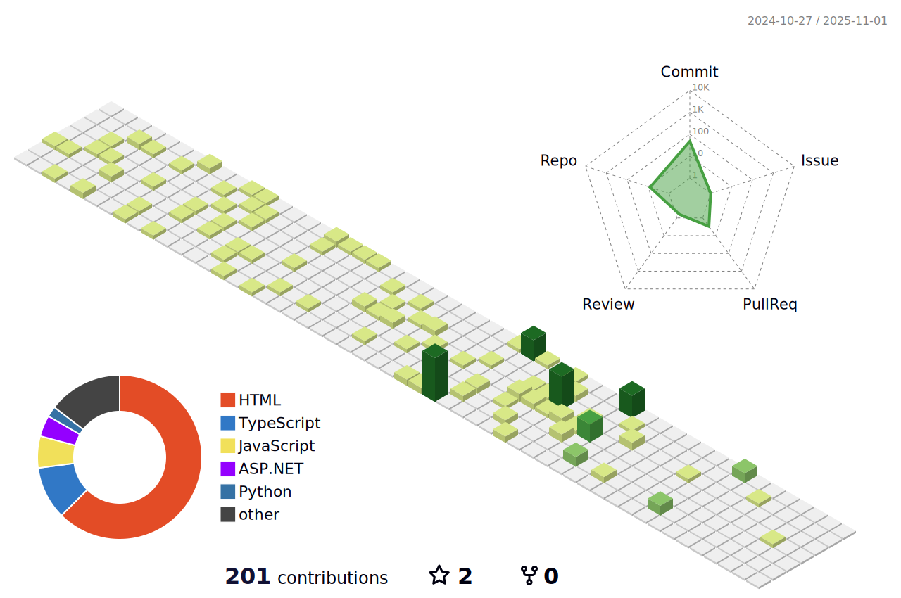

<!-- 🌊 Animated Wave Header -->

<!--

  
  
  

-->

##  About Me
 **Full-Stack Developer** | MERN | ASP.NET | Python | C++  
 Built **E-Learning Platform** & **Water Supply Management System** & **more in repo**  
 Reach me at: **makvanapankaj608@gmail.com**

---

##  My Tech Stack

  

---

## Featured Projects

###  E-Learning Platform (MERN Stack)
Interactive platform for students and instructors.  
** Features:**
-  User authentication
- Course management
-  Video streaming

---

###  Water Supply Management System (ASP.NET)

** Features:**
-  Admin control panel
-  Water distribution scheduler

---

## GitHub Stats

  
  

---

##  Most Used Languages

    

---

##  3D Contributions Calendar

  

---

##  Contribution Snake Animation

  

---

<h2>Connect with me on     &nbsp;</h2>

<!--  -->
<!--  -->

---

##  Profile Visitors

  

---

  

